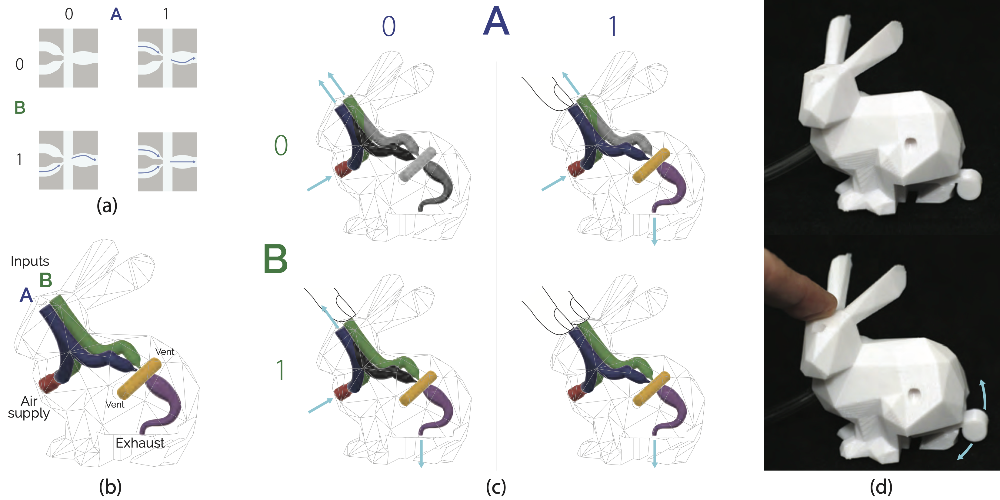

<h2>AirLogic: Embedding Pneumatic Computation and I/O in 3D Models to Fabricate Electronics-Free Interactive Objects</h2>

### Abstract

Researchers have developed various tools and techniques towards the vision of on-demand fabrication of custom, interactive devices. Recent work has 3D-printed artefacts like speakers, electromagnetic actuators, and hydraulic robots.  However, these are non-trivial to instantiate as they require post-fabrication mechanical-- or electronic assembly. We introduce AirLogic: a technique to create electronics-free, interactive objects by embedding pneumatic input, logic processing, and output widgets in 3D-printable models. AirLogic devices can perform basic computation on user inputs and create visible, audible, or haptic feedback; yet they do not require electronic circuits, physical assembly, or resetting between uses. Our library of 13 exemplar widgets can embed AirLogic-style computational capabilities in existing 3D models. We evaluate our widgets' performance---quantifying the loss of airflow (1) in each widget type, (2) based on printing orientation, and (3) from internal object geometry. Finally, we present five applications that illustrate AirLogic's potential.

### Working Principle

Our goal is to fabricate interactive devices with little to no user intervention in the production and operation process. For this vision, we require a computing substrate with the following properties:
  - It should be able to be completely produced on a single printer with no user intervention;
  - It should be capable of sensing, processing, and output;
  - It should be embeddable in objects during printing;
  - It should be stateless: objects should not require re-setting after use.

To create such a substrate, we rely on pneumatic airflow in combination with the principles of fluerics as described in the previous section. Unlike previous pneumatics-based approaches which required external sensing, and complex fabrication techniques, AirLogic uses a single-step fabrication process, senses a variety of input events, performs simple computations based on those events, and creates output based on the computations. The key is that---inspired in part by fluerics---we use 3D-printed geometry to enable a continuous flow of air to act as a *power source*, allowing AirLogic-based structures to perform functions analogous to those performed by electrical circuits. Because the fluid has a specific origin and destination and does not travel in a loop, we refer to these structures as "transits". Here we briefly explain how each of AirLogic's three main parts (input, logic, output) work in the context of the sample object illustrated in the image above.

Flueric transits behave analogously to electronic circuits. Once the bunny device illustrated in the figure above has finished printing, the first step is to provide it with a power source in the form of pressurized air. This air input is analogous to VIN or V+ in an electronic circuit, and can be seen entering the front of the bunny through a clear tube. The air flows through channels and splitters (analogous to wires) fabricated in the body of the model. The designer has specified two touch points on the bunny's surface. These are designed such that, in the absence of touch, air vents through them to the atmosphere (analogous to electrical ground). When blocked, however, the channels route the air to a flueric `OR` gate (described in-depth below). With either touch sensor covered, the air flows to the oscillating actuator (very roughly analogous to a motor) embedded in the bunny's tail, which then wiggles up and down with the force of the air striking the paddle on its way to the atmosphere.

While the functioning of the input and output widgets is fairly intuitive, the operation of flueric logic gates is less so. As noted, and similar to historical flueric gate designs, these operate on the principle of momentum transfer between jets of air: an air jet's course can be modified by striking it with another air jet. Each logic gate in AirLogic uses 3D-printed geometry to form streams of air into jets and to direct those jets into an "interaction region". In the case of the `OR` gate, a single air jet from either input proceeds at an angle through the interaction region, and the cupping wall of the output channel catches it and directs it to the output. When both are present, they collide, canceling each other's angle and forming a single coherent jet that exits the output.

### Repository Overview

In this repository you will find the essential information to get started with AirLogic. You can find the academic paper [here](https://www.carlosetejada.com/s/airlogic.pdf) for more details, various three-dimensional [models](assets/models) of AirLogic-augments objects, experimental [source code](src) for our design suite, and various [multimedia assets](assets/media).